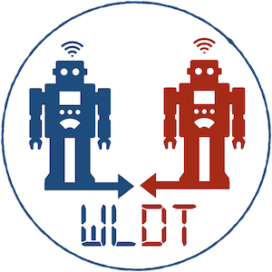

### What is a digital Twin?

A **Digital Twin** (DT) is a comprehensive software representation of any individual **Physical Asset** (PA) in the real world.  
It includes the properties, conditions, relationships, and behavior(s) of the real-life object through models and data.  
A Digital Twin is a set of realistic models that can digitalize an object’s behavior in the deployed environment and has the responsibility to represent and reflect its physical counterpart over time maintaining its digital replica across the object’s entire lifecycle.

### What can WLDT do for me?

The White Label Digital Twin (WLDT) library aims to support the design, development, and deployment of Digital Twins within the Internet of Things (IoT) ecosystems.  
The library has been designed following the latest DT definitions coming from both Industrial and Scientific domains and identifying DTs as active, flexible and scalable software components.

### Scientitic Citation & Reference 

If you use the WLDT Library in a Scientific Paper please use this reference: 

```
@article{PICONE2021100661,
    title = {WLDT: A general purpose library to build IoT digital twins},
    journal = {SoftwareX},
    volume = {13},
    pages = {100661},
    year = {2021},
    issn = {2352-7110},
    doi = {https://doi.org/10.1016/j.softx.2021.100661},
    url = {https://www.sciencedirect.com/science/article/pii/S2352711021000066},
    author = {Marco Picone and Marco Mamei and Franco Zambonelli},
    keywords = {Internet of Things, Digital twin, Library, Software agent}
}
```