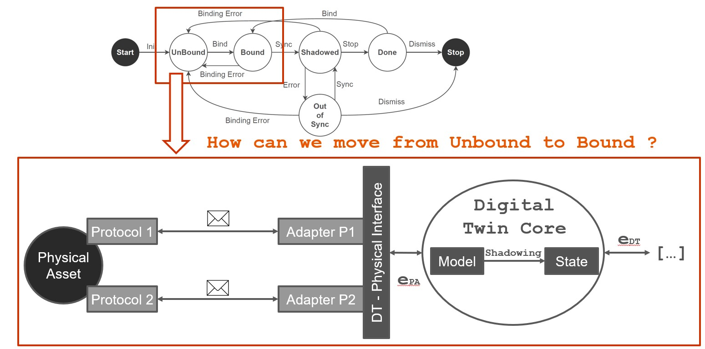
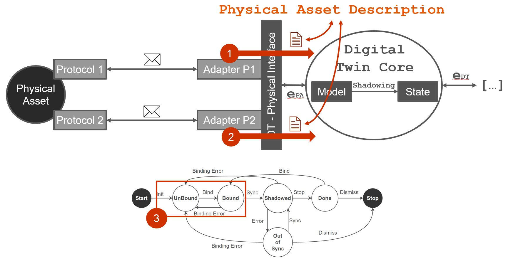
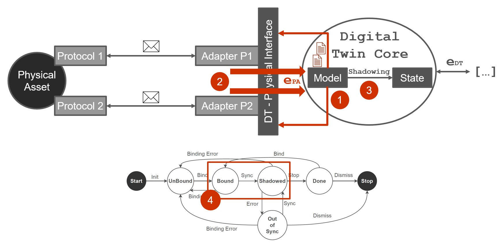
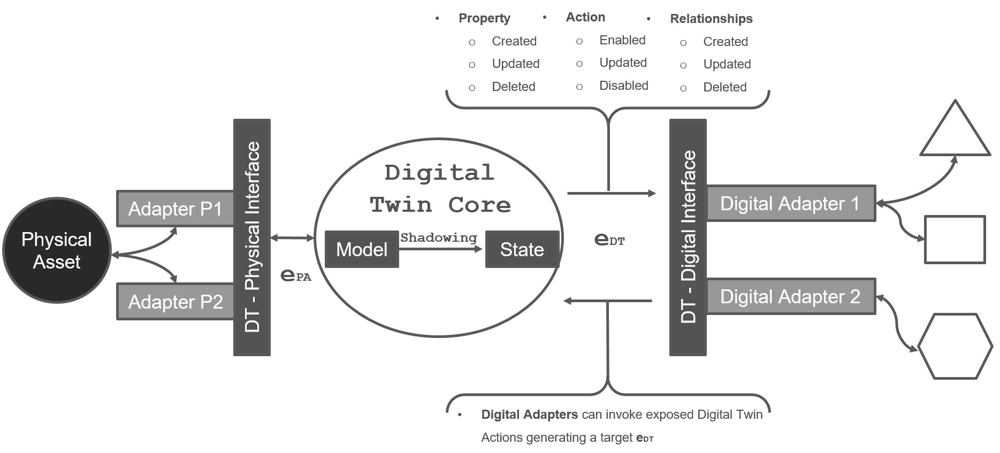

The modeling of the concept of DT includes also the definition and characterization of its life cycle. 
Based on the scientific literature, we model (and then map into the library) a life cycle with 5 states 
through which the DT goes from when it is executed to when it is stopped. 
The previous Figure shows a graphical representation of the life cycle with the following steps:

- **Operating & Not Bound**: this is the state in which the DT is located following the initialization phase, 
indicating that all internal modules of the DT are active but there is no association yet with the corresponding PA.
- **Bound**: this is the state in which the DT transitions following the correct execution of the binding procedure. 
The binding procedure allows to connect the two parts and enables bidirectional flow of events.
- **Shadowed**: this is the state reached by the DT when the shadowing process begins and its state 
is correctly synchronized with that of the PA.
- **Out of Sync**: this is the state that determines the presence of errors in the shadowing process.
When in this state, the DT is not able to handle either state alignment events or those generated 
by the application layer.
- **Done**: this is the state that the DT reaches when the shadowing process is stopped, 
but the DT continues to be active to handle requests coming from external applications.

#### From Unbound to Bound

Taking into account the target reference Life Cycle the first point to address is how we can move from an `UnBound` state
to a `Bound` condition with respect to the relationship with the Physical Layer. 

The previous Figure illustrates a simple scenario where a Physical Asset uses two protocols (P1 and P2) to communicate and it is 
connected to the Digital Twin through a DT's Physical Interface enabled with two dedicated Adapters for protocol P1 and P2.
In order to move from the Unbound to Bound state the DT should be aware of the description of the target asset with respect to
the two protocols. For example through P1 the asset exposes telemetry data (e.g., light bulb status and energy consumption) 
while on P2 allows incoming action requests (e.g., turn on/off the light). The Digital Twin can start the shadowing process 
only when it is bound and has a description of the properties and capabilities of the associated physical counterpart.
The schematic procedure is illustrated in the following Figure: 

Involved steps are: 

1. The Adapter P1 communicates with the PA through Protocol 1 and provides a ``Physical Asset Description`` from its perspective
2. The Adapter P2 communicates with the PA through Protocol 2 and provides a ``Physical Asset Description`` from its perspective
3. Only when all Physical Adapters have been correctly bound (it may require time) to the Physical Asset and the associated ``Physical Asset Descriptions`` 
have been generated, the DT can move from UnBound to Bound

Main core aspects associated to the concept of Physical Asset Description (PAD) are the following: 

- It is used to describe the list of **properties**, **actions** and **relationships** of a Physical Asset
- Each Physical Adapter generates a dedicated PAD associated to its perspective on the Physical Assets 
and its capabilities to read data and execute actions
- It is a responsibility of the DT to handle multiple descriptions in order to build the digital replica
- It will be used by the DT to handle the shadowing process and keep the digital replica synchronized with the physical counterpart

#### From Bound to Shadowed

Following the same approach described in the previous step we need to define a procedure to allow the DT to move from  a `Bound` state
to a `Shadowed` condition where the twin identified the interesting capabilities of the Physical Asset that has to be 
digitalized and according to the received Physical Asset Descriptions start the shadowing procedure to be synchronized with the physical world.

As schematically illustrated in the previous Figure, involved steps are:

1. The Model defines which properties should be monitored on the Physical Asset and start observing 
them through the target adapters
2. Involved Physical Adapters communicate with the Physical Asset, receive data and generate Events (ePA) 
to notify about physical property changes
3. Received ePA will be used by the Digital Twin Model in order to run the
Shadowing function and compute the new DT State
4. The DT can move from the Bound to Shadowed phase until it is able to maintain a proper synchronization 
with the physical asset over time through its shadowing process and the generation and maintenance of the DT's State

The Digital Twin State is structured and characterized by the following elements:

- A list of properties
- A list of actions
- A list of relationships

Listed elements can be directly associated to the corresponding element of the Physical Asset or generated by DT Model 
combining multiple physical properties, actions or relationships at the same time. The Digital Twin State can be managed
through the Shadowing Function and exposes a set of methods for its manipulated. When there is a change in the DT State an event (eDT) will be generated

The manipulation of DT's State generates a set of DT's events (eDT) associated to each specific variation and evolution of the 
twin during its life cyle. These events are used by the Digital Interface and in particular by its Digital Adapters to 
expose the DT's State, its properties and capabilities to the external digital world. At the same time, eDT can be used by
Digital Adapters to trigger action on the DT and consequently to propagate (if acceptable and/or needed) 
the incoming request to the physical assets bound with the target DT. Supported events are illustrated in the following 
schema. 

## Library Structure & Basic Concepts

The WLDT framework intends to maximize modularity, re-usability and flexibility in order to effectively mirror
physical smart objects in their digital counterparts.  The proposed library focuses on the simplification of twins
design and development aiming to provide a set of core features and functionalities for the widespread
adoption of Internet of Things DTs applications.

A WLDT instance is a general purpose software entity
implementing all the features and functionalities of a Digital Twin running
in cloud or on the edge. It has the peculiar characteristic
to be generic and ``attachable'' to any physical thing in order to
impersonate and maintain its digital replica and extend the provided functionalities
for example through the support of additional protocols or a specific translation
or normalization for data and formats.

Hereafter, the requirements that led the design and development of the WLDT framework are:
- i) Simplicity - with WLDT developers must have the possibility to easily create a new instance by using
  existing modules or customizing the behavior according the need of their application scenario;
- ii) Extensibility - while WLDT must be as simple and light as possible,
  the API should be also easily extendible in order to let programmers to personalize
  the configuration and/or to add new features loading and executing multiple modules at the same times;
- iii) Portability & Micorservice Readiness - a digital twin implemented through WLDT must
  be able to run on any platform without changes and customization. Our goal is to have a simple and light core engine
  with a strategic set of IoT-oriented features allowing the developer to easily create DT applications modeled
  as independent software agents and packed as microservices.

In the following Figure, the main components that make up the architecture of WLDT are represented, 
and thus through which the individual Digital Twin is implemented. 
Specifically, from the image it is possible to identify the three levels on which the 
architecture is developed: the one related to the ``core`` of the library, the one that ``models`` the DT, 
and finally, that of the ``adapters``.

Each of this core components has the following main characteristics:

- **Metrics Manager**: Provides the functionalities for managing and tracking various metrics 
within DT instances combining both internal and custom metrics through a flexible and extensible approach.
- **Logger**: Is designed to facilitate efficient and customizable logging within implemented and deployed DTs with 
configurable log levels and versatile output options.
- **Utils & Commons**: Hold a collection of utility classes and common functionalities that can be readily employed 
across DT implementations ranging from handling common data structures to providing helpful tools for string manipulation.
- **Event Communication Bus**: Represents the internal Event Bus, designed to support communication between
the different components of the DT's instance. It allows defining customized events to model
both physical and digital input and outputs. Each WLDT's component can publish on the shared Event Bus and define
an Event Filter to specify which types of events it is interested in managing,
associating a specific callback to each one to process the different messages.
- **Digital Twin Engine**: Defines the multi-thread engine of the library allowing the execution and monitoring of 
multiple DTs (and their core components) simultaneously. Therefore, it is also responsible for orchestrating 
the different internal modules of the architecture while keeping track of each one, and it can be 
considered the core of the platform itself allowing the execution and control of the deployed DTs. Currently, it supports
the execution of twins on the same Java process, however the same engine abstraction might be used to extend the framework to 
support distributed execution for example through different processes or microservices.
- **Digital Twin**: Models a modular DT structure built through the combination of core functionalities together with physical
and digital adapter capabilities. This Layer includes the `Digital Twin State`  responsible to structure the state of the DT by defining the list of properties, events, and actions. 
The different instances included in the lists can correspond directly to elements of the physical asset 
or can derive from their combination, in any case, it is the `Shadowing Function (SF)` that defines 
the mapping, following the model defined by the designer. 
This component also exposes a set of methods to allow SF manipulation. 
Every time the Digital Twin State is modified, the latter generates the corresponding DT's event to notify all the components 
about the variation. 
- **Shadowing Function**: It is the library component responsible for defining the behavior of 
the Digital Twin by interacting with the Digital Twin State. 
Specifically, it implements the shadowing process that allows keeping the 
DT synchronized with its physical entity. 
This component is based on a specific implementation of a WLDT Worker called Model Engine,
in order to be executed by the WLDT Engine.
The Shadowing Model Function is the fundamental component that must be extended by the DT designer 
to concretize its model. 
The shadowing function observes the life cycle of the Digital Twin to be notified of the different state changes. 
For example, it is informed when the DT enters the Bound state, i.e. when its Physical Adapters
have completed the binding procedure with the physical asset. This component also allows the designer
 to define the behavior of the DT in case a property is modified, an event is triggered, or an action is invoked.
- **Physical Adapter**: It defines the essential functionalities that the individual extensions, 
related to specific protocols, must implement. 
As provided by the DT definition, a DT can be equipped with multiple Physical Adapters 
in order to manage communication with the corresponding physical entity. 
Each will produce a `Physical Asset Description (PAD)`, 
i.e., a description of the properties, events, actions, and relationships 
 that the physical asset exposes through the specific protocol. 
The DT transitions from the Unbound to the Bound state when all its Physical Adapters 
have produced their respective PADs. 
The Shadowing Function, following the DT model, 
selects the components of the various PADs that it is interested in managing.
- **Digital Adapter**: It provides the set of callbacks that each specific implementation can use
to be notified of changes in the DT state. 
Symmetrically to what happens with Physical Adapters, a Digital Twin can define 
multiple Digital Adapters to expose its state and functionality through different protocols.

Therefore, to create a Digital Twin using WLDT, it is necessary to define and instantiate a DT with its Shadowing Function and 
at least one Physical Adapter and one Digital Adapter, in order to enable connection with the physical 
entity and allow the DT to be used by external applications. Once the 3 components are defined, 
it is possible to instantiate the WLDT Engine and, subsequently, start the lifecycle of the DT. 
In the following sections we will go through the fundamental steps to start working with the library and creating all 
the basic modules to design, develop and execute our first Java Digital Twin.

## Further reading

- Read [about how-to guides](https://diataxis.fr/how-to-guides/) in the Diátaxis framework
